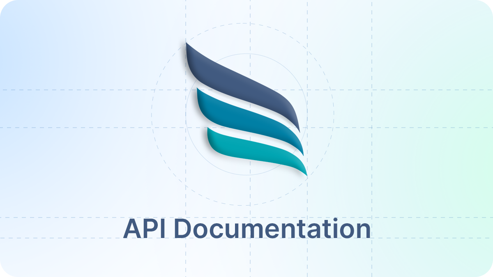

<CardGroup cols={2}>
  <Card title="Edit Your Docs" icon="pen-to-square" href="https://mintlify.com/docs/quickstart">
    Get your docs set up locally for easy development
  </Card>

  <Card title="Preview Changes" icon="image" href="https://mintlify.com/docs/development">
    Preview your changes before you push to make sure they're perfect
  </Card>
</CardGroup>

The Online Check Writer API provides developers with a comprehensive suite of tools to integrate seamless payment solutions into applications, simplifying transactions with a range of options like ACH transfers, eChecks, and wire transfers. Tailored for businesses and developers aiming to streamline financial operations, this API offers endpoints for managing payments, processing checks, automating approvals, and much more

## Make it yours

Update your docs to your brand and add valuable content for the best user conversion.

<CardGroup cols={2}>
  <Card title="Customize Style" icon="palette" href="https://mintlify.com/docs/settings/global">
    Customize your docs to your company's colors and brands
  </Card>

  <Card title="Reference APIs" icon="code" href="https://mintlify.com/docs/api-playground/openapi">
    Automatically generate endpoints from an OpenAPI spec
  </Card>

  <Card title="Add Components" icon="screwdriver-wrench" href="https://mintlify.com/docs/components/accordion">
    Build interactive features and designs to guide your user
  </Card>

  <Card title="Get Inspiration" icon="stars" href="https://mintlify.com/customers">
    Check out our showcase of our favorite documentation
  </Card>
</CardGroup>